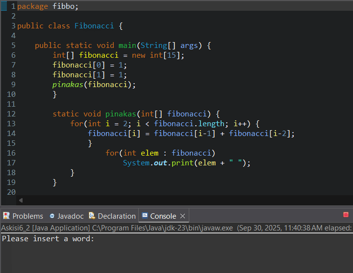

## Demo

Description: 

A simple educational Java program that calculates and displays the first 15 terms of the Fibonacci sequence. The program creates an array of 15 integers, initializes the first two terms to 1, calculates the subsequent terms as the sum of the two preceding ones, and prints all the elements on a single line separated by spaces.

Key features:

• Language: Java.

• Implementation method: Static array and iterative loop.

• Execution: No external libraries, only JDK required.

Brief flow explanation:
1. A 15-element array is created.
2. The first two terms are initialized to 1.
3. Using a loop, the subsequent terms are computed as the sum of the two previous ones.
4. All terms are printed to the console.

Code Analysis:

• package fibbo;  => Defines the package for the class file.

• public class Fibonacci { ... }  => Class that contains the main execution method.

• public static void main(String[] args) {  => The program's entry point.

• int[] fibonacci = new int[15];  => Creates an array of length 15 for the sequence terms.

• fibonacci[0] = 1;fibonacci[1] = 1;  => Initializes the first two terms of the sequence to 1.

• pinakas(fibonacci);  => Calls a method that fills and prints the array.

• static void pinakas(int[] fibonacci) {  => Method that receives the array, fills the remaining elements, and prints them.

• for(int i = 2; i < fibonacci.length; i++) { fibonacci[i] = fibonacci[i-1] + fibonacci[i-2]; }  => Loop that calculates each new term as the sum of the two previous ones.

• for(int elem : fibonacci) System.out.print(elem + " ");  => Enhanced loop to print all elements in a single line.

Requirements:

• 	Java JDK 8+ installed

Possible improvements:
- Accept input data from the user.
- Use BigInteger for very large terms.
- Add checks for limits and error messages.
